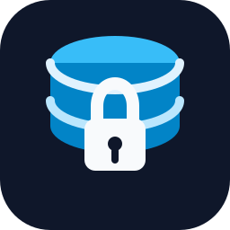

<p align="center">
  
</p>

<h1 align="center">db-readonly</h1>

<p align="center">
  数据库只读 MCP 服务，目前支持达梦和 MySQL。
</p>

<p align="center">
  <a href="README.md">简体中文</a> |
  <a href="README.en.md">English</a>
</p>

<p align="center">
  
  
  
</p>

## 能做什么

`db-readonly` 用于让 Codex 等 MCP 客户端通过受控方式只读查询数据库。

支持：

- 列出已配置的数据源。
- 查看表字段和字段类型。
- 查询指定表的指定字段。
- 执行受限制的 `SELECT` 查询。
- 达梦 datasource 支持 Java 风格实体名到表名推断。

不支持：

- 执行 `INSERT`、`UPDATE`、`DELETE`、`CREATE`、`ALTER`、`DROP`。
- 执行 `SELECT *`。
- 查询未配置的 schema / database。
- 在 YAML 配置里保存数据库密码。
- MySQL 第一版暂不支持 entity 映射。

## 前置条件

- Windows。
- Python 3.11 或以上。
- 对应数据库的 ODBC 驱动。
- 一个只读数据库账号。
- Codex 或其他支持 MCP 的客户端。

ODBC 驱动需要自己安装。本项目的 `setup.ps1` 只安装 Python 依赖，不安装数据库驱动。

驱动安装后执行：

```powershell
.\setup.ps1 -Drivers
```

查看本机真实驱动名，再填入 `config.local.yaml`。

MySQL 用户需要先安装 MySQL Connector/ODBC：

https://dev.mysql.com/downloads/connector/odbc/

## 快速开始

### 1. 安装

```powershell
cd path\to\db-readonly
.\setup.ps1
```

### 2. 配置数据源

复制配置模板：

```powershell
Copy-Item config.example.yaml config.local.yaml
```

达梦示例：

```yaml
datasources:
  dm-dev:
    dbType: "dm"
    project: "your-project"
    env: "dev"
    description: "Development Dameng database"
    driver: "DM8 ODBC DRIVER"
    host: "127.0.0.1"
    port: 5236
    schema: "YOUR_SCHEMA"
    username: "READONLY_USER"
    passwordEnv: "DM_READONLY_PASSWORD"
    maxRows: 100
    queryTimeoutSeconds: 10
    allowTables: ["*"]
    denyTables: []
```

MySQL 示例：

```yaml
datasources:
  mysql-dev:
    dbType: "mysql"
    project: "your-project"
    env: "dev"
    description: "Development MySQL database"
    driver: "MySQL ODBC 8.0 Unicode Driver"
    host: "127.0.0.1"
    port: 3306
    schema: "your_database"
    username: "readonly_user"
    passwordEnv: "MYSQL_READONLY_PASSWORD"
    maxRows: 100
    queryTimeoutSeconds: 10
    allowTables: ["*"]
    denyTables: []
```

说明：

- `dbType` 不填时默认 `dm`。
- 达梦的 `schema` 表示 schema。
- MySQL 的 `schema` 表示 database。
- MySQL 表名和字段名允许小写。

### 3. 配置密码

不要把密码写进 `config.local.yaml`。

```powershell
[Environment]::SetEnvironmentVariable("MYSQL_READONLY_PASSWORD", "your_password", "User")
```

设置后重启终端或 MCP 客户端。

### 4. 启动

```powershell
.\run.ps1
```

### 5. 验证

```powershell
.\.venv\Scripts\python.exe scripts\verify.py
.\.venv\Scripts\python.exe scripts\check_db_connection.py
```

## Codex MCP 配置

在 Codex 配置中加入：

```toml
[mcp_servers.db-readonly]
command = "powershell.exe"
args = ["-ExecutionPolicy", "Bypass", "-File", "C:\\path\\to\\db-readonly\\run.ps1"]
```

修改后重启 Codex。

## MCP 工具

- `datasource_list`
- `table_describe`
- `table_query`
- `sql_query`
- `entity_resolve`：仅达梦默认映射
- `entity_describe`：仅达梦默认映射
- `entity_query`：仅达梦默认映射

MySQL 第一版推荐先用 `table_describe` 确认真实表名和字段名，再用 `table_query` 或 `sql_query` 查询。

## 安全限制

- 数据源必须显式配置。
- 查询范围限制在 datasource 对应的 schema / database。
- 返回行数由 `maxRows` 限制。
- SQL 执行前会做只读校验。
- 数据库密码只从环境变量读取。

建议数据库账号本身也只授只读权限。
